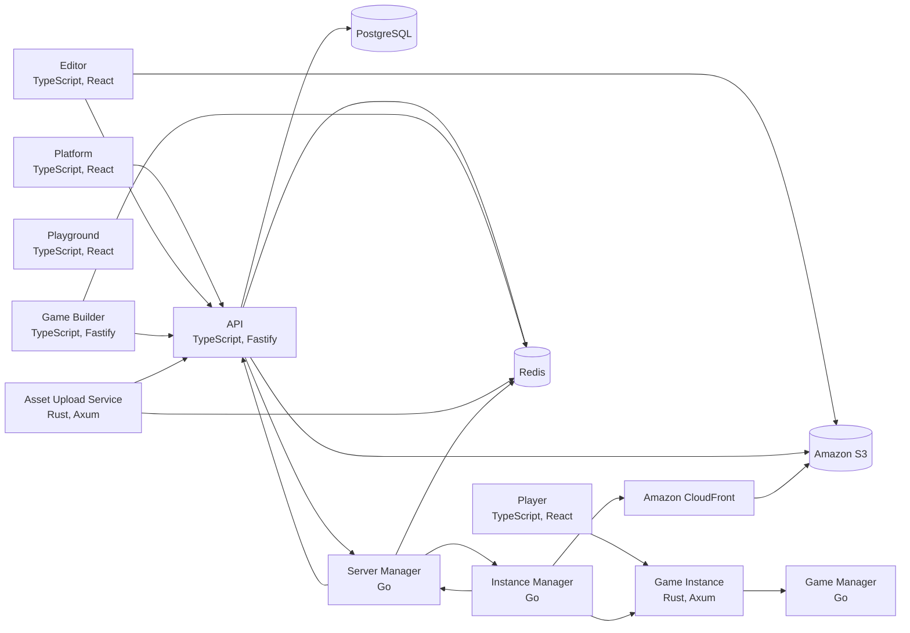

# Grove

Grove is a 2D multiplayer game platform for students, where younger creators build games with blocks and older ones write TypeScript against the same API. Games run on one deterministic TypeScript engine that drives the editor's live preview in the browser and runs inside Rust game processes on an EC2 fleet scheduled by Go services.

