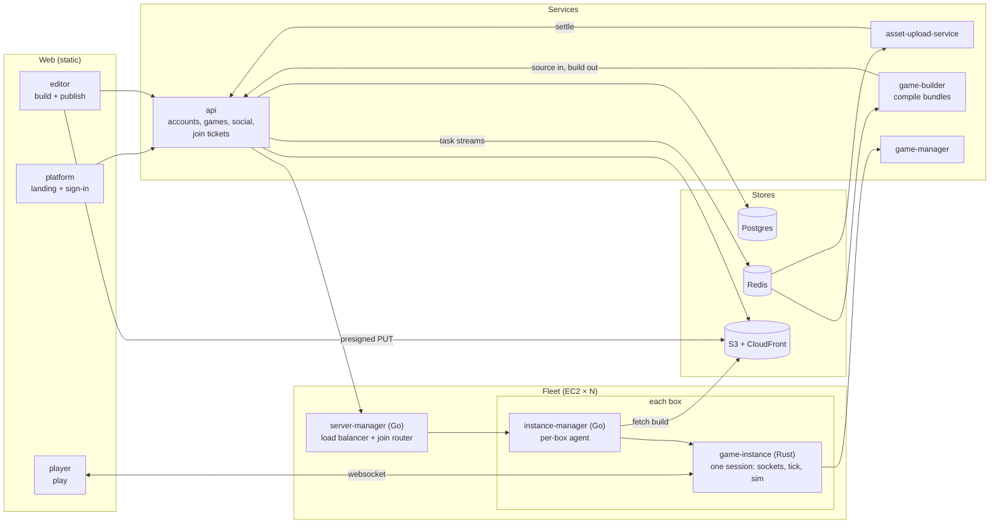

# Development

Grove is a 2D multiplayer game platform for students, roughly elementary through high school. Younger creators build with blocks; older ones write TypeScript against the same API. The blocks _are_ the TypeScript, just shown differently, so creators move up gradually instead of jumping from a "toy" tool to a "real" one. Games run on a deterministic engine (`packages/*`). The same engine runs in-process for the editor's live preview and inside a Rust `game-instance` on the production fleet.

## Architecture



## Running it locally

`compose.yaml` at the root is for development only; nothing deploys from it. It comes in three
layers, because most work needs only the first. Copy `.env.example` to `.env` first: compose refuses
to start without the three secrets in it.

```sh
docker compose up                    # Postgres, Redis and LocalStack
docker compose --profile app up      # and every service, from the images that deploy
docker compose --profile fleet up    # and one box of the fleet, for a session end to end
```

The browser apps are not in there. They deploy to a static host and their dev server already reloads
on an edit, so they run on the host against whichever layer is up:

```sh
pnpm --filter @grove/platform dev    # localhost:5175
pnpm --filter @grove/editor dev      # localhost:5176
pnpm --filter @grove/player-app dev  # localhost:5177
```

| Reached at           | What                                                 |
| -------------------- | ---------------------------------------------------- |
| `localhost:4000`     | `api`                                                |
| `localhost:4001/3/4` | `game-manager`, `server-manager`, `instance-manager` |
| `localhost:4002`     | `game-builder`                                       |
| `localhost:4005`     | `asset-upload-service`                               |
| `127.0.0.1:5432`     | Postgres, for `psql` or a GUI on the host            |
| `127.0.0.1:6379`     | Redis                                                |
| `localhost:4566`     | LocalStack: S3, and only S3                          |

The stores are the three a deployment hands the fleet, so nothing in a service knows it is running
locally: the games bucket is LocalStack's, reached through `S3_ENDPOINT` with versioning on because a
manifest freezes a version id per file. The one value compose has to contradict is `NODE_ENV`, which
the image sets to `production` and compose sets back: it alone decides whether the session cookie
carries `Secure`, and nothing here terminates TLS.

Running a session end to end also needs build output in the bucket for the agent to fetch, which is a
publish through `game-builder` rather than something compose can stand up on its own.

## Deploying

An image is built from the repository root against the Dockerfile beside the service it builds,
because the lockfile, `tsconfig.base.json`, the Cargo workspace and the root `go.mod` are all inputs a
package cannot resolve alone:

```sh
docker build -f apps/grove/api/Dockerfile -t grove-api .
```

| Where     | What                                                                                                                  | Provisioned by                |
| --------- | --------------------------------------------------------------------------------------------------------------------- | ----------------------------- |
| Static    | `platform`, `editor`, `player`, each built by its own `pnpm build`                                                    | any static host               |
| Railway   | `api`, `game-builder`, `game-manager`, `server-manager`, `asset-upload-service`                                       | each one's `railway.json`     |
| AWS       | the games bucket and its CloudFront distribution, the DynamoDB tables, the task streams' ElastiCache Serverless cache | Terraform, `apps/grove/infra` |
| EC2 fleet | `instance-manager` and `game-instance`, three regions, one autoscaling group each                                     | Terraform, `apps/grove/infra` |

Each Railway service's `railway.json` names its Dockerfile, a `/health` check, and a 35-second drain
past the 30 seconds each service spends draining. Every service listens on the `PORT` Railway
assigns. `api` applies its migrations as a pre-deploy command rather than on the way up, so a process
that starts has a schema already.

A fleet box runs no container. Its launch template boots an AMI that must already carry
`/opt/grove/bin/instance-manager` and `/opt/grove/bin/grove-game-instance`, found through the SSM
parameter each environment names in `fleet_ami_parameter`; user-data only writes the systemd unit
and the script that fetches the two shared secrets from Parameter Store before every start.
`apps/grove/infra/README.md` states how that image is built. `docker/local-fleet-box.Dockerfile` is
the same pair arranged so one machine can hold a session, and it deploys nowhere.

Two network paths have to exist before a deployment works, and neither Terraform nor Railway
builds them:

- The task streams are an ElastiCache Serverless cache in a private VPC, answering only TLS
  (`rediss://`). `api`, `game-builder` and `asset-upload-service` reach it only once that VPC is
  peered, or joined by VPN or a transit gateway, with the network they run in, and
  `task_client_cidrs` names their blocks.
- Every fleet box beats to `server_manager_url` and hands its game processes `game_manager_url`,
  both `*.grove.internal` names. They resolve only where a private DNS zone and a route from the
  fleet VPCs to those Railway services have been set up.
